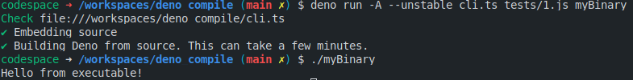

# deno_compile

Experminental `deno compile` alternative.

Notable features:

- Icon support (Windows).
- Source protection.
- Copyright labels.
- Embedded assets.
- Binary optiomization level.

```shell
denoc --assets=example.json,sample.txt --icon=icon.ico bundle.js myExecutable
```


